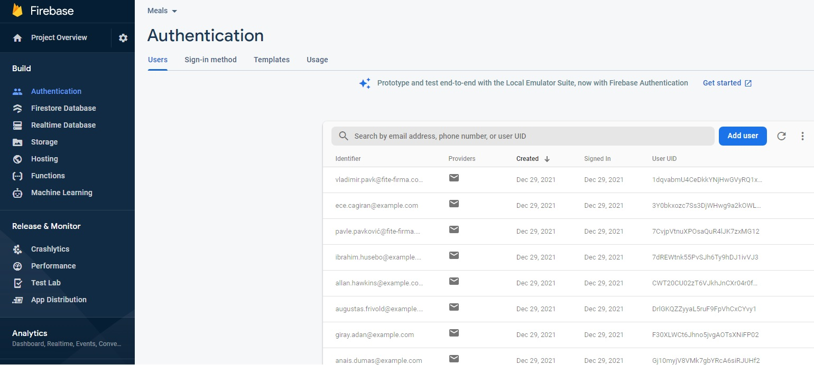
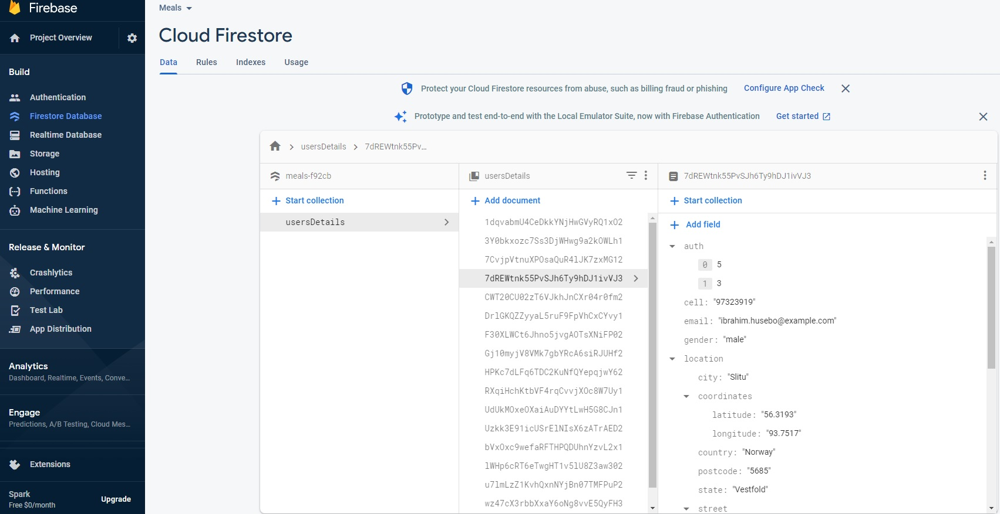

# Firebase Auth with React, Redux

It's a security risk and not a good practice to access database server direct from the frontend. You should always accesss your backend first. Check errors and potential security breaches on both ends.

In this example email and password authentication provider is used. Firebase offers many different kind of providers. Firestore database.

## **Questions to answer:**

1. How to store ***additional user informations***, besides what is stored in user credential **Firebase.Auth.Credential** object?
2. How to add multiple authorization levels and how to store it in ***additional user informations*** ?
3. How to configure **Firebase Auth rules** to meet user authorization levels privileges ?

## **Requirements**

### **Additional user informations**
1. **Additional user informations** will be stored in database root branch, **FireBase Firestore** in a ***/usersDetails*** collection,
2. Each ***/users/Details/{userDetails}*** document will have an document ID equal to the user's UID returned when user is signed in,
3. Each ***/users/Details/{userDetails}*** document will have ***auth*** array that contains authorization levels given to a specified user,
4. Each ***/users/Details/{userDetails}*** document will contain properties that store ***additional user informations*** data.

### **Authorization levels**
1. Any user can have multiple authorization levels,
2. Each user can read own ***additional user informations***,
3. Authorization levels must meet certain criterias as follows:
    - **Level 0** - can read any user's ***additional user informations***,
    - **Level 1** - can create ***additional user informations*** and **Firebase.Auth. Credential** user,
    - **Level 2** - can delete any ***additional user informations*** and **Firebase.Auth. Credential** user,    
4. Authorization levels can be combined i.e. [0, 1], can read and create ***additional user informations*** and **Firebase.Auth.Credential** user.

### User interface
1. User interface must be adaptive to each user authorization levels,
2. Menu items will be dependent to authorization levels,
3. Each autorization level has it's own menu items,
4. **React Redux** will be used to store local data and will be synced with **Firebase Auth state.**.

### Prior knowledge
1. Basic Javascript, React, Redux knowledge is required to follow code,
2. Basic knowledge for following **Firebase** modules/functions is required:
    - **firebase/firestore**
        - collection(),
        - query(),
        - where(),
        - getDocs(),
        - doc(),
        - getDoc(),
    - **firebase/auth**
        - signInWithEmailAndPassword(),
        - createUserWithEmailAndPassword(),
        - onAuthStateChanged(),
        - signOut().

If you are not familiary with prior knowledge requirements please visit links below:
 - [Manage Users in Firebase](https://firebase.google.com/docs/auth/web/manage-users?authuser=0)
 - [Authenticate with Firebase using Password-Based Accounts using Javascript](https://firebase.google.com/docs/auth/web/password-auth?authuser=0)
 - [Security Rules language](https://firebase.google.com/docs/rules/rules-language)

 ## Initialize dummy data
 1. Go to ./src/db/init folder
 2. npm install
 3. Create **environment.js** module file that contains two exported constants:
    - **firebaseConfig** - contains firebase application configuration object(pointing to a firebase app/database)
    - **firebaseDefaultUserPassword** - contains default user's password, for simplicity it is by default the same for all dummy users
4. npm start
5. Wait until *'All ok... Firebase initialized'* message is displayed.
6. You are now good to go. We have setup Firebase Authentication/Users, a list of users handled by Firebase, and a new collection */{database}/usersCollection* containing additional user information all meet previously mentioned requirements.
7. **Firebase users** 
8. **Additional users infromation** 

## *...to be continued*